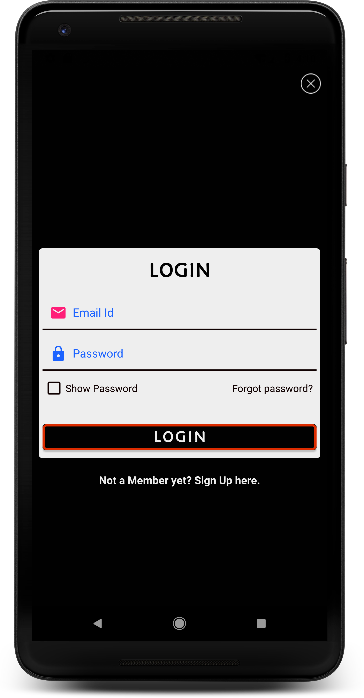
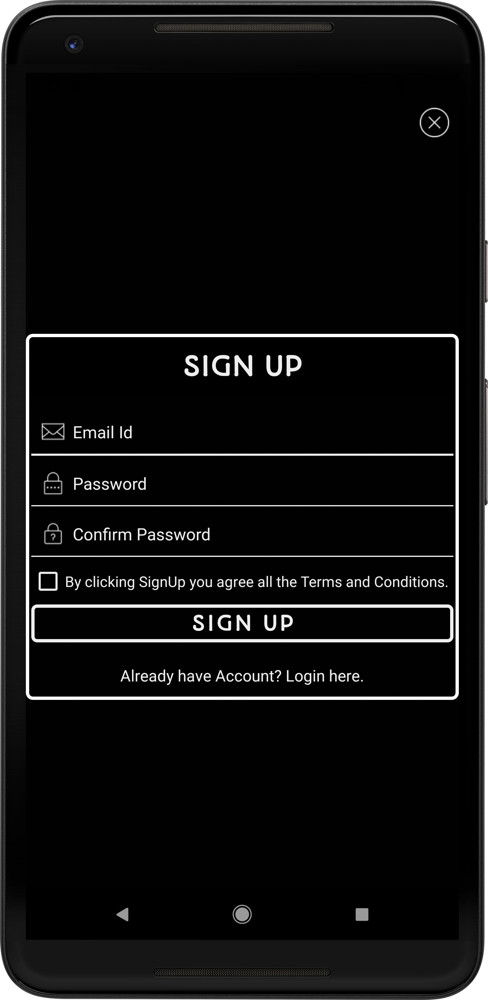
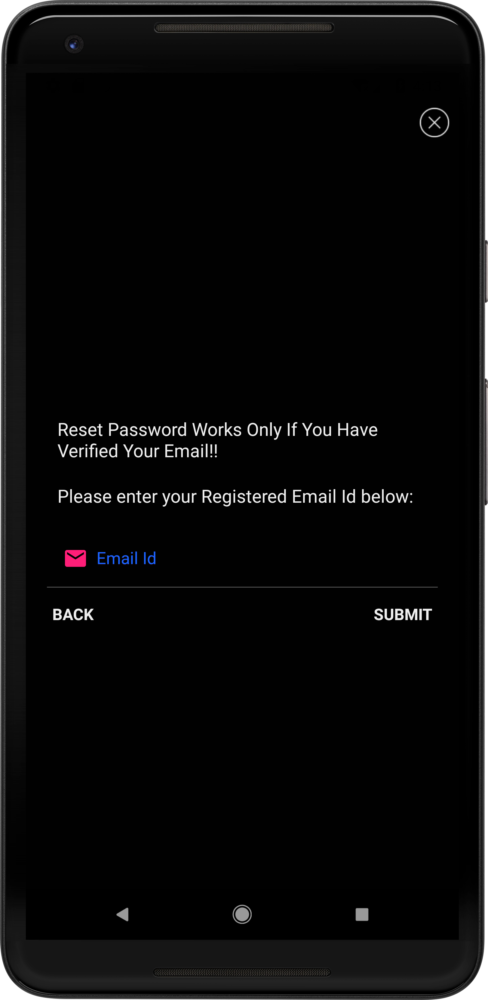

# Firebase_Email
Email Authentication with Firebase after the email is verified 
Make sure to create firebase project enable email authentcication download google-services.json in app folder.
## SCREENSHOTS
    

### LICENSE & COPYRIGHT
Copyright 2018 Pratik Banawalkar

Licensed under the Apache License, Version 2.0 (the "License");
you may not use this file except in compliance with the License.
You may obtain a copy of the License at

   http://www.apache.org/licenses/LICENSE-2.0

Unless required by applicable law or agreed to in writing, software
distributed under the License is distributed on an "AS IS" BASIS,
WITHOUT WARRANTIES OR CONDITIONS OF ANY KIND, either express or implied.
See the License for the specific language governing permissions and
limitations under the License.
